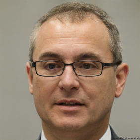
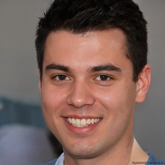
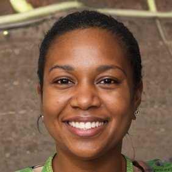
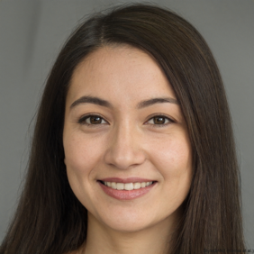
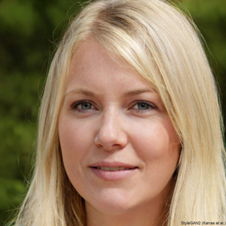
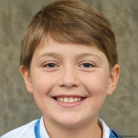

# Personas

### Persona 1
| Persona: | Project Manager |
| --- | --- |
| Photo: |  |
| Fictional Name: | "John Avery" |
| Job title/ major responsibilities | Senior Project Manager at an IT Consultancy Company - Overseeing project timelines - Resource allocation - Ensuring project goals are met |
| Demographics: | Male 54 years old Holds a PMP certification Experienced in Agile methodologies |
| Goals and tasks: | To efficiently manage multiple projects, keep the team on track, and deliver on time and budget |
| Environment: | Corporate office setting |  
| Technologies/OS used: | Work Desktop (Windows) Personal Laptop (macOS) |
| Competency with similar applications: | Advanced to Expert Familiar with various project management tools like JIRA, Trello, and Asana |
| Quote: | *"I need to streamline project communication and progress tracking to ensure timely delivery."* |
 

### Persona 2
| Persona: | Graphic Designer |
| --- | --- |
| Photo: |  |
| Fictional Name: | "Alex Rivera" |
| Job title/ major responsibilities |  Graphic and Digital Ad Designer - Creating visual content - Collaborating with clients - Refining designs based on feedback |
| Demographics: | Male 30 years old Undergraduate Degree in Graphic Design Proficient in Adobe Creative Suite |
| Goals and tasks: | To share and receive real-time feedback on designs, and work collaboratively with other team members |
| Environment: | Design studio  Remote work environments |  
| Technologies/OS used: | Professional Desktop (macOS) |
| Competency with similar applications: | Intermediate to Advanced High proficiency with design software Moderate experience with collaboration tools like InVision or Figma |
| Quote: | *"I need a collaborative space that allows me to present and iterate on designs in real-time with my team and clients."* |
 

### Persona 3
| Persona: | Software Developer |
| --- | --- |
| Photo: |  |
| Fictional Name: | "Naomi Chen" |
| Job title/ major responsibilities | Full Stack Software Developer - Writing and reviewing code - Debugging code - Contributing to software architecture discussions |
| Demographics: | Female 28 years old Bachelor's degree in Computer Science Proficient in multiple programming languages |
| Goals and tasks: | To collaborate on coding projects, share code snippets, and discuss architecture in a live environment |
| Environment: | Tech company or remote work from a home office |  
| Technologies/OS used: | Work Desktop (Windows) Personal Laptop (Windows) |
| Competency with similar applications: | Advanced to Expert Comfortable with Git, Slack, and integrated development environments like Visual Studio Code |
| Quote: | *"A seamless, integrated environment for live coding collaboration is key to a developer’s productivity."* |
 

### Persona 4
| Persona: | Educator |
| --- | --- |
| Photo: |  |
| Fictional Name: | "Sarah Bennett" |
| Job title/ major responsibilities | Sociology Teacher at a Sixth Form College - Teaching - Creating curricula - Fostering interactive online learning environments |
| Demographics: | Female 48 years old Master’s degree in Education Familiar with e-learning platforms |
| Goals and tasks: | To engage students in a collaborative and interactive learning experience, provide resources, and monitor progress |
| Environment: | Academic institution Virtual classroom |  
| Technologies/OS used: | Laptop (Windows) Smartphone (iOS) |
| Competency with similar applications: | Intermediate Experience includes Office 365, Teams and learning management systems like Moodle |
| Quote: | *"I need an intuitive platform where I can engage students and encourage collaboration, even from a distance."* |
 

### Persona 5
| Persona: | University Student |
| --- | --- |
| Photo: |  |
| Fictional Name: | "Emma Gonzalez" |
| Job title/ major responsibilities | Full-time student - Active in study groups and extracurricular activities Part-time barista |
| Demographics: | Female 21 years old Third-year undergraduate in Biology Attends a large public university |
| Goals and tasks: | Needs to collaborate on class projects, share notes, and organize study sessions |
| Environment: | Campus Home Coffee shops Libraries |  
| Technologies/OS used: | University Desktop (Windows) Personal Laptop (macOS) Smartphone (iOS) |
| Competency with similar applications: | Intermediate Comfortable with digital technology. Uses educational apps like Google Classroom, Canva and Evernote |
| Quote: | *“I’m always on the move, so I need a way to connect and work with my classmates wherever I am.”* |
 

### Persona 6
| Persona: | Remote Team Member |
| --- | --- |
| Photo: |  |
| Fictional Name: | "Isabella Torres" |
| Job title/ major responsibilities | Remote Systems Architect  - Develops high-level system design specifications - Works with a global team across different time zones |
| Demographics: | Female 29 years old Master's degree in Computer Science Works from home |
| Goals and tasks: | To maintain clear communication with team members, manage tasks efficiently, and meet development deadlines |
| Environment: |  Home office Occasionally co-working spaces |  
| Technologies/OS used: | Personal Desktop (Windows) Smartphone (Android) |
| Competency with similar applications: | Expert Highly skilled in various collaboration tools like Slack, Zoom, and GitHub |
| Quote: | *"Coordinating with my team across continents requires a flexible and reliable virtual workspace."* |
 

### Persona 7
| Persona: | Board Game Enthusiast |
| --- | --- |
| Photo: |  |
| Fictional Name: | "Tyler Smith" |
| Job title/ major responsibilities | Accountant Avid board game hobbyist - Volunteers at a local board game club - DM for his friends' DnD group |
| Demographics: | Male 26 years old Enjoys strategy and role-playing games |
| Goals and tasks: | To find ways to play board games online, wants to recreate the experience of in-person gaming sessions |
| Environment: | Board game cafes Home gaming room Friend's homes for in-person game nights |  
| Technologies/OS used: | Desktop Gaming Computer (Windows) Tablet (iOS) Smartphone (iOS) |
| Competency with similar applications: | Intermediate to Advanced Familiar with online gaming platforms like Tabletop Simulator and Roll20 |
| Quote: | *"Finding a platform where I can play intricate board games online with friends is my weekend unwind."* |
 

### Persona 8
| Persona: | Event Planner |
| --- | --- |
| Photo: |  |
| Fictional Name: | "Rachel Green" |
| Job title/ major responsibilities | Professional event planner - Manages weddings, corporate events, and large conferences |
| Demographics: | Female 34 years old Owns a small event planning business |
| Goals and tasks: | To organize event details, collaborate with clients and oversee multiple vendors |
| Environment: | Various event locations Her office On-site visits |  
| Technologies/OS used: | Professional Laptop (Windows) Smartphone (iOS) |
| Competency with similar applications: | Intermediate Uses project management and event planning software like Asana and Social Tables |
| Quote: | *“Every event is a new challenge; I need tools that help me visualize and execute each detail flawlessly.”* |
 

### Persona 9
| Persona: | Young Student |
| --- | --- |
| Photo: |  |
| Fictional Name: | "Lucas Martin" |
| Job title/ major responsibilities | Secondary school student - Attends online classes - Completes homework assignments |
| Demographics: | Male 12 years old Year 7  |
| Goals and tasks: | To engage with online learning material, complete interactive assignments and participate in group work |
| Environment: | Home School After-school programs |  
| Technologies/OS used: | School Desktop (Windows) Tablet (Android) |
| Competency with similar applications: | Novice Somewhat familiar with educational games and learning platforms like Kahoot! and Google Classroom |
| Quote: | *“I like when learning is fun and I can do activities with my friends online, just like in school!”* |
